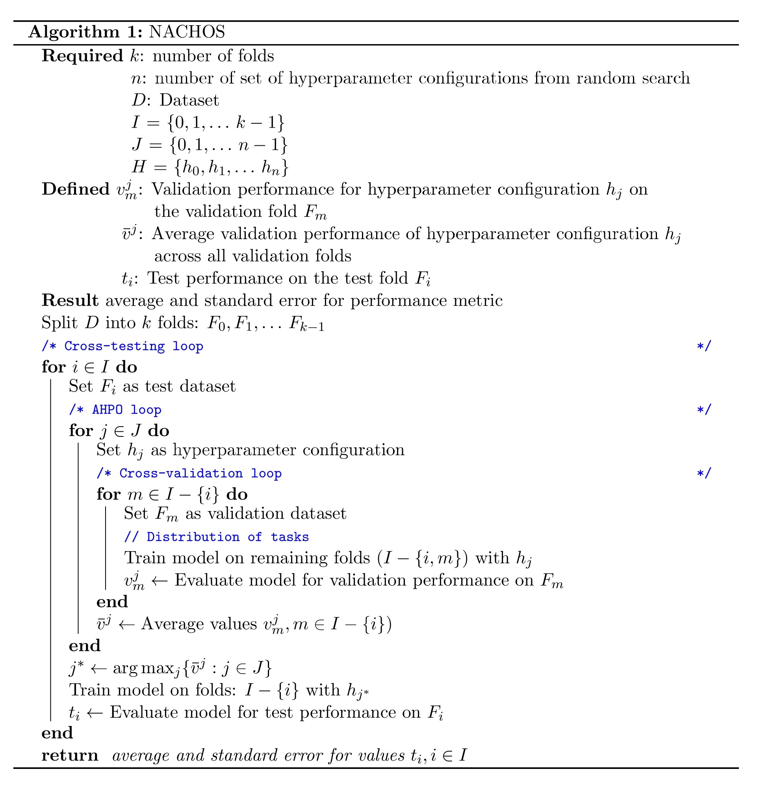

# Pipeline Overview

NACHOS uses the following algorithm 

There are three important loops:
* Cross-testing (CT) loop: Iterates over the test folds
* Automated HyperParameter Optimization (AHPO) loop: iterates over the hyperparameters configurations
* Cross-validation (CV) loop: perform the classical CV

The final outcome 